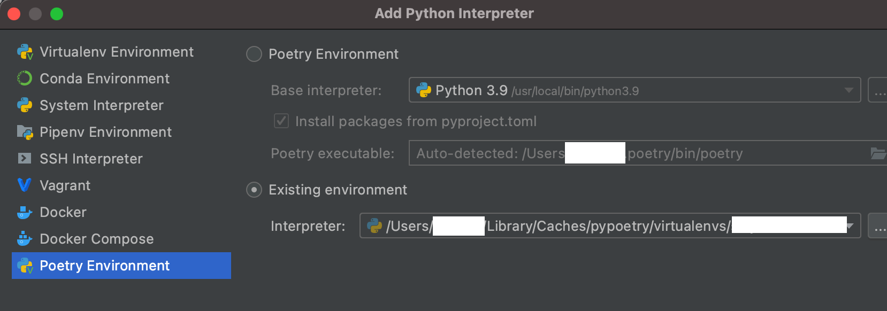

# Poetry

## Dependency manager

#### Install

`curl -sSL https://raw.githubusercontent.com/python-poetry/poetry/master/get-poetry.py | python3`

#### Check it worked

```bash
poetry --version
poetry check
```

#### PyCharm

Add Poetry plug-in to `PyCharm`:



#### Set bash/zsh profile

< `export PATH="$HOME/.poetry/bin:$PATH"` not required >

#### Add to existing project

`poetry init`

#### Add

`poetry add boto3`

#### Set machine to run code

```bash
# git clone Python repo that uses Poetry
poetry shell
poetry install
exit poetry
```

#### Run outside of Poetry shell

`poetry run python3 src/main.py`

#### Check and change config

```bash
poetry config --list 
poetry config cache-dir "$(pwd)"  
poetry config virtualenvs.in-project true  
```

#### Fixing mix ups

```bash
#failed due to enum stopping it being removed
poetry add simplejson
#fix was to remove enum
poetry remove enum 
```

#### Show latest versions available

`poetry show --latest`

#### Dependencies and sub-dependencies

`poetry show --tree`
